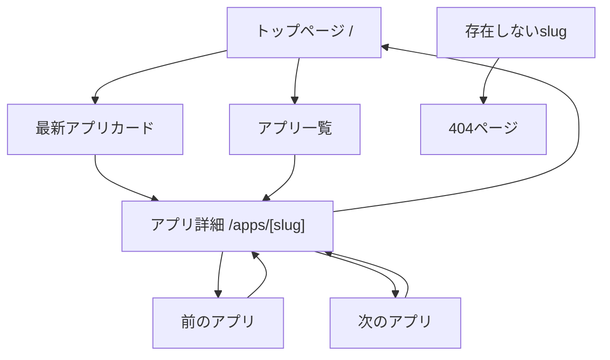

# 画面遷移設計

## ルーティング

```text
/                 トップページ
/apps/[slug]      アプリ詳細ページ
/_not-found       404ページ
```

## 画面遷移



## トップページ `/`

### 目的

チャレンジの概要、現在の進捗、アプリ一覧を1ページで見せる。

### データ取得

- `getApps()`
- `getPublishedApps()`
- `getLatestApp()`
- `getProgress()`

### 表示ロジック

- 進捗は登録済みアプリの最大Day、または `published` の最大Dayを基準にする。
- 初期実装では Day1 のみ表示する。
- `status` が `planned` のアプリも一覧には出せるが、視覚的に公開済みと区別する。

## アプリ詳細ページ `/apps/[slug]`

### 目的

各アプリの制作背景と学びを記録として残す。

### データ取得

- `getAppBySlug(slug)`
- `getAdjacentApps(slug)`

### 表示ロジック

- `slug` が存在しない場合は `notFound()` を呼び出す。
- `thumbnail` が存在する場合のみスクリーンショット枠を表示する。
- `appUrl`、`githubUrl` は存在する場合のみリンクを表示する。
- 前後リンクは Day番号順で判定する。

## 404ページ

### 目的

存在しないURLでも、サイトの雰囲気を保ったままトップページに戻れるようにする。

表示内容:

- 見つからなかった旨
- トップページへのリンク
- 必要ならアプリ一覧への導線

## Next.js 16 App Router での注意

このプロジェクトの Next.js は `16.2.6`。`AGENTS.md` の通り、実装前に `node_modules/next/dist/docs/` の該当ガイドを確認する。

特に確認済みの前提:

- Metadata は `metadata` オブジェクトまたは `generateMetadata` を使い、手動で `<head>` を書かない。
- `generateMetadata` は Server Component 側で扱う。
- Dynamic route の `generateStaticParams` は静的生成対象の `slug` を返すために使う。
- 存在しない `slug` は `next/navigation` の `notFound()` で処理する。
